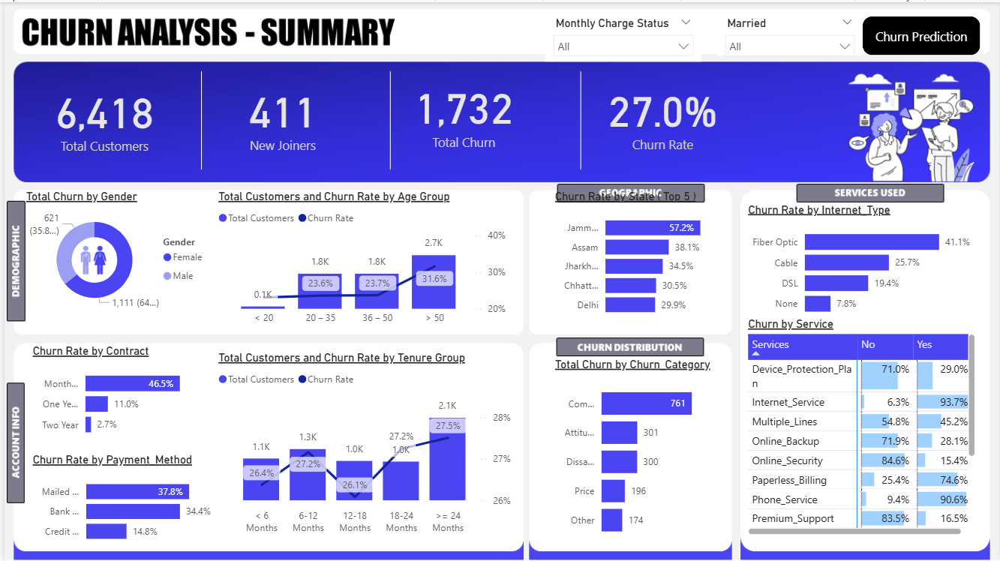
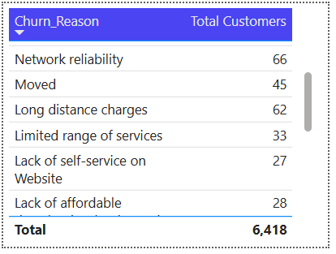
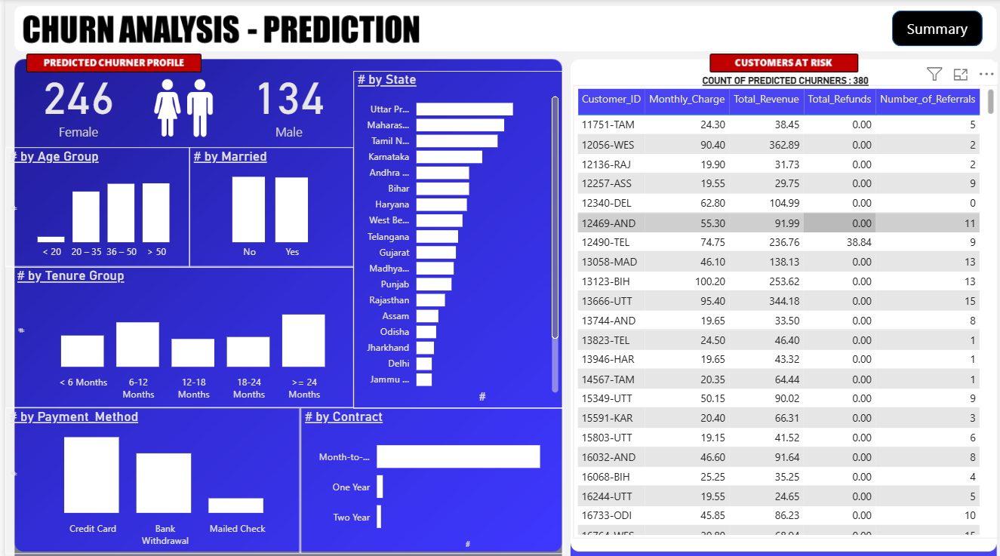

# 📊 Customer Churn Analysis using SQL, Power BI & Machine Learning

🚀 **End-to-End Data Analytics Project | SQL | Power BI | Machine Learning**


An **end-to-end Data Analytics project** that analyzes telecom customer churn and predicts customers likely to leave using **SQL Server, Power BI, and Machine Learning (Random Forest).**

This project demonstrates a **complete data pipeline** from raw data ingestion to predictive insights, helping businesses improve **customer retention strategies.**

---

# 🚀 Project Overview

Customer churn is a major challenge for telecom companies. Retaining customers is often **more cost-effective than acquiring new ones.**

This project builds a **complete churn analytics system** that:

✔ Processes raw telecom data using **SQL ETL**
✔ Builds **interactive dashboards in Power BI**
✔ Trains a **machine learning model to predict churn**
✔ Identifies **high-risk customers for retention campaigns**

---

# 🎯 Project Objectives

* Analyze historical churn behavior
* Identify key factors influencing churn
* Build predictive models for churn detection
* Provide actionable insights through dashboards

---

# 🔄 End-to-End Analytics Pipeline

```
Raw Dataset
     ↓
SQL Server ETL Pipeline
     ↓
Cleaned Analytical Dataset
     ↓
Power BI Dashboard
     ↓
Machine Learning Model
     ↓
Predicted Churn Customers
```

---

# 🏗️ System Architecture

```
Raw Dataset (CSV)
      ↓
SQL Server Database
      ↓
Staging Table (stg_Churn)
      ↓
Data Cleaning & Transformation
      ↓
Production Table (prod_Churn)
      ↓
SQL Views (vw_ChurnData, vw_JoinData)
      ↓
Power BI Dashboard
      ↓
Machine Learning Model (Random Forest)
      ↓
Predicted Churn Customers
```

---

# 📊 Dashboard Preview

## Customer Churn Analysis Dashboard

<p align="center">

</p>

This dashboard provides insights into:

* Total Customers
* Churn Rate
* Customer Demographics
* Service Usage
* Geographic churn distribution

---

## Churn Reason Analysis

<p align="center">

</p>

Key churn drivers identified:

* Network reliability issues
* High service charges
* Limited service availability
* Poor self-service experience

---

## Churn Prediction Dashboard

<p align="center">

</p>

The machine learning model predicts **customers most likely to churn**, enabling **proactive retention strategies.**

---

# ⚙️ ETL Pipeline (SQL Server)

The ETL pipeline performs the following tasks.

## 1️⃣ Data Ingestion

Raw telecom dataset imported into staging table:

```
stg_Churn
```

---

## 2️⃣ Data Cleaning

Missing values were handled using SQL transformations such as:

```sql
ISNULL(Value_Deal, 'None')
```

---

## 3️⃣ Production Dataset

Cleaned data is stored in:

```
prod_Churn
```

---

## 4️⃣ Analytical Views

Two analytical views were created:

```
vw_ChurnData
vw_JoinData
```

These views are used for:

* Power BI analytics
* Machine learning model training

---

# 🤖 Machine Learning Model

A **Random Forest Classification Model** is used to predict churn probability.

### Model Pipeline

1. Data preprocessing
2. Encoding categorical variables
3. Train-test split (80/20)
4. Model training
5. Model evaluation

---

# 📊 Model Performance

| Metric    | Score    |
| --------- | -------- |
| Accuracy  | 88%      |
| Precision | High     |
| Recall    | High     |
| F1 Score  | Balanced |

---

# 📈 Feature Importance

Important churn drivers identified by the model:

* Contract type
* Customer tenure
* Monthly charges
* Internet service usage

These insights help businesses design **better retention strategies**.

---

# 💼 Business Value

This project helps telecom companies:

* Identify **high-risk customers**
* Design **targeted retention campaigns**
* Improve **service quality**
* Reduce **customer churn**

---

# 🛠️ Technology Stack

| Technology       | Purpose                         |
| ---------------- | ------------------------------- |
| SQL Server       | Data storage & ETL pipeline     |
| Power BI         | Data visualization & dashboards |
| Python           | Machine learning model          |
| Pandas           | Data preprocessing              |
| NumPy            | Data manipulation               |
| Scikit-Learn     | Random Forest model             |
| Jupyter Notebook | Model development               |

---

# 📂 Project Structure

```
customer-churn-analysis
│
├── dashboard
│   └── churn_dashboard.pbix
│
├── dashboard_Images
│   ├── churn_analysis.png
│   ├── churn_prediction.png
│   └── churn_reason.png
│
├── data
│   ├── raw
│   │   └── Customer_Data.csv
│   │
│   ├── processed
│   │   └── Prediction_Data.xlsx
│   │
│   └── predictions
│       └── Predictions.csv.xlsx
│
├── notebooks
│   └── churn_prediction.ipynb
│
├── sql
│   └── churn_etl.sql
│
├── doc
│   └── project_architecture.md
│
└── README.md
```

---

# 🚀 How to Run the Project

### 1️⃣ Setup SQL Database

Run the SQL script:

```
sql/churn_etl.sql
```

---

### 2️⃣ Open Power BI Dashboard

Open the Power BI file:

```
dashboard/churn_dashboard.pbix
```

---

### 3️⃣ Train Machine Learning Model

Run the Jupyter notebook:

```
notebooks/churn_prediction.ipynb
```

---

# 📌 Future Improvements

Possible enhancements include:

* Deploy ML model as an **API**
* Automate **ETL pipelines**
* Implement **real-time churn prediction**
* **Cloud deployment using AWS / Azure**

---

# 👨‍💻 Author

**Paras Jain**
B.Tech CSE (Artificial Intelligence)
KIET Group of Institutions

---

# 🔗 Connect With Me

GitHub
https://github.com/ParasJain03

LinkedIn
https://www.linkedin.com/in/paras-jain-9b4a4023b/
